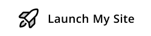

<div align="center">
<!--      -->
    <h1>QuickStore</h1>
    <a href="https://quick-store-sigma.vercel.app/"><b>quick-store-sigma.vercel.app »</b></a><br><br>
    <strong>A SaaS service for small-scale shop owners to get their products accessible to a much larger audience in just a few minutes.</strong>
</div>
<br><br>

## About QuickStore

QuickStore is a template codebase for small-scale shop owners to get their products accessible to a much larger audience in just a few minutes. The shop owner just needs to sign-up for the various free services that are used in the software and fill out the form given below. And bam.. as soon as the person clicks the deploy my website button, He gets an admin panel ready to work with. Next, he needs to fill out the Store form, to host his/ her store, which he can share with the customers to interact and make orders form. Apart from this, the admin system allows users to plug in the API to their custom websites for flexibility in setup.
</br>
</br>
<div align="center">
   <a href="https://quick-store-sigma.vercel.app/">
      
   </a>   
</div>
<br><br>
<div align="center">
    
</div>


</br>

## Tech-Stack

1. [NextJs](https://nextjs.org/)- Enables developers to create full-stack Web applications super-fast and deploy them much faster by optimizing builds.
2. [MySQL](https://www.mysql.com/)- A relational database organized in the form of tables whose data may be related to each other.
3. [Prisma](https://www.prisma.io/)- Acts as a Typescript ORM(Object-Relational Mapping), that talks to the database and returns the data in a typesafe manner.
4. [PlanetScale](https://planetscale.com/)- To host MySQL database online.
5. [Stripe](https://stripe.com/en-in)- To enable payments.


<div align="center">
    <h2>Live Demo</h2>
    <a href="https://warehouse-admin.vercel.app/"><b>warehouse-admin.vercel.app</b></a> •
    <a href="https://client-store.vercel.app/"><b>client-store.vercel.app</b></a><br><br>
</div>
<br><br>

## Setup project on your system

### WareHouse System [Admin Panel]-

1. Clone the repository:

```shell
   git clone https://github.com/Hadeso-0/warehouse-admin.git
```

2. Install packages

```shell
  npm i
```

3. Setup environment variables:

```js
SHOP_NAME=
FRONTEND_STORE_URL=
DATABASE_URL=
STRIPE_API_KEY= 
STRIPE_WEBHOOK_SECRET=
NEXT_PUBLIC_CLOUDINARY_CLOUD_NAME=
NEXT_PUBLIC_CLOUDINARY_PRESET_NAME=
NODE_ENV="development"
NEXT_PUBLIC_CLERK_PUBLISHABLE_KEY=
CLERK_SECRET_KEY=
NEXT_PUBLIC_CLERK_SIGN_IN_URL=/sign-in
NEXT_PUBLIC_CLERK_SIGN_UP_URL=/sign-up
NEXT_PUBLIC_CLERK_AFTER_SIGN_IN_URL=/
NEXT_PUBLIC_CLERK_AFTER_SIGN_UP_URL=/
```

4. Connect to PlanetScale and Push Prisma

```shell
   npx prisma generate
   npx prisma db push
```

5. Start the app

```shell
npm run dev
``` 
### Store System [Client Store]-

1. Clone the repository:

```shell
   git clone https://github.com/Hadeso-0/client-store.git
```

2. Install packages

```shell
  npm i
```

3. Setup environment variables:

```js
NEXT_PUBLIC_API_URL=
NEXT_PUBLIC_STORE_NAME=
NEXT_PUBLIC_STORE_DESC=
```

4. Start the app

```shell
npm run dev
``` 
